# GTA
Esqueleto del proyecto GTA
Gestión de Tiendas de Autoservicio

El proyecto esta creado en JAVA EE, pero decidió exportarse a Python utilizando el framework djando, desgraciadamente el proyecto se perdió.

Esto fue lo único que quedó :( 
Estaremos trabajando para volver a crear este proyecto ya sea en JAVA EE o Django

##Capturas de navegación funcionando en servidor local

###Página de inicio

###Página de solicitante
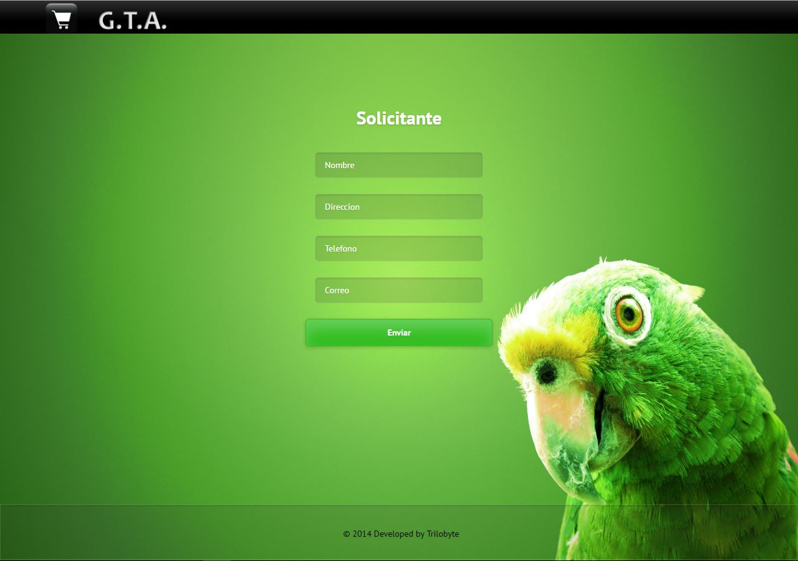
 

###Página de inicio de usuario
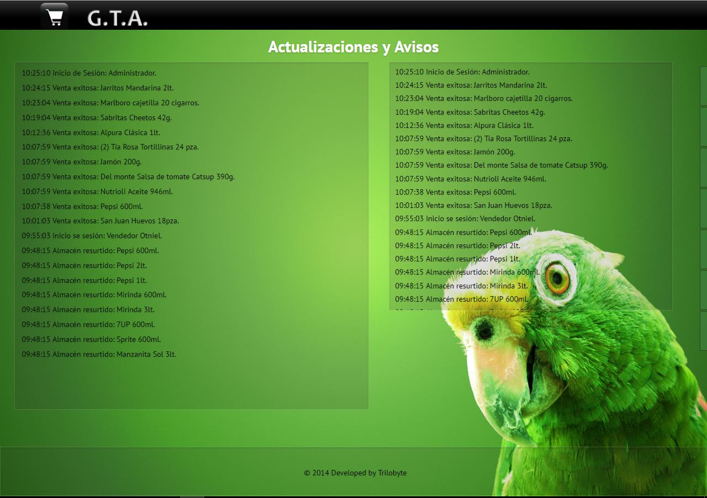

###Página de Almacén
####Agregar un producto
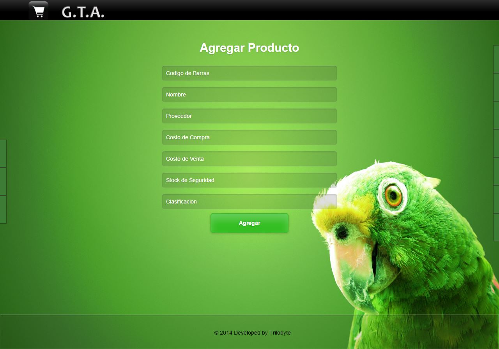

####Eliminar un producto
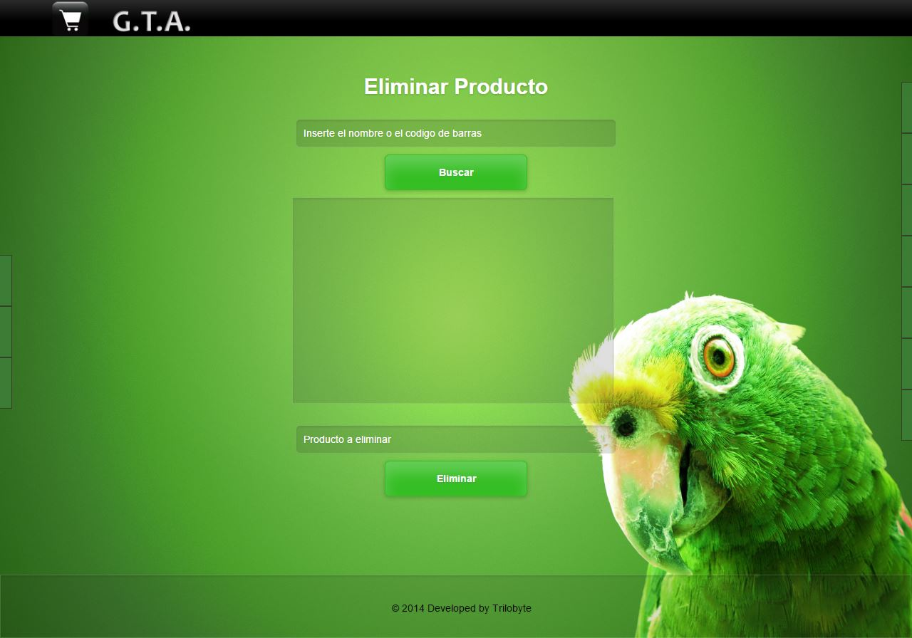

####Buscar un producto
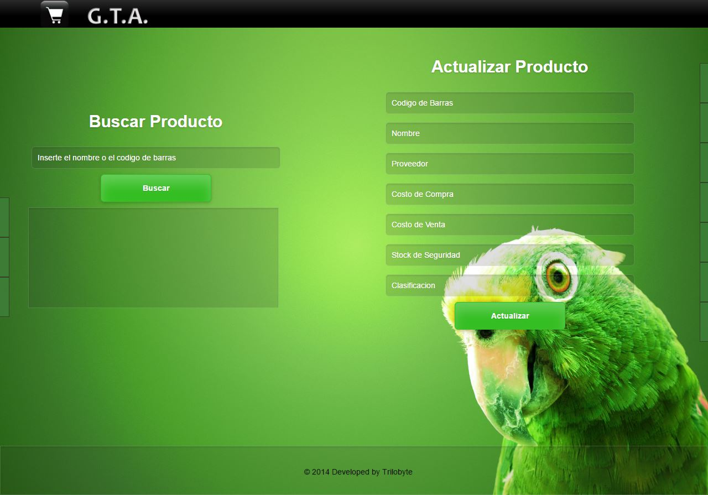

###Página de ventas
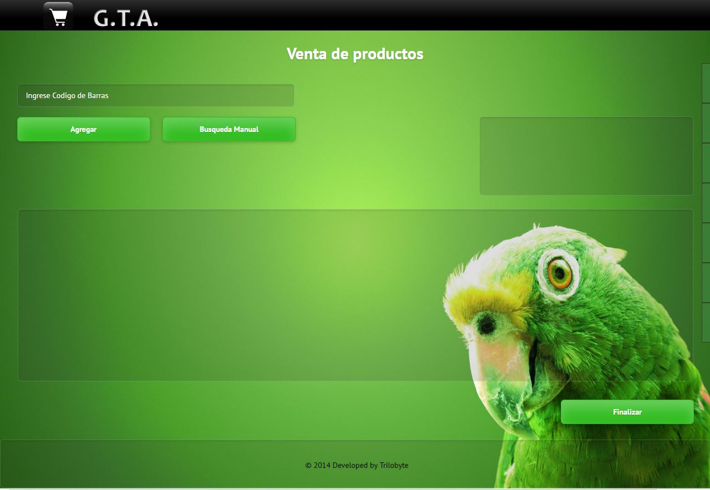

###Página de pedidos
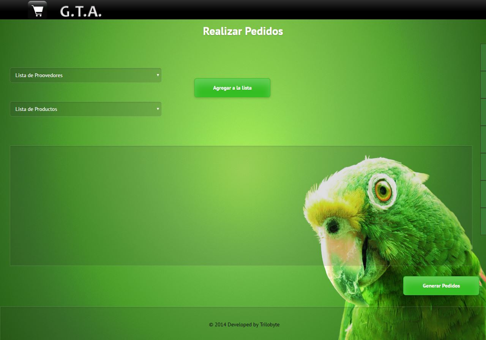

###Página de Consultas
####Consulta individual
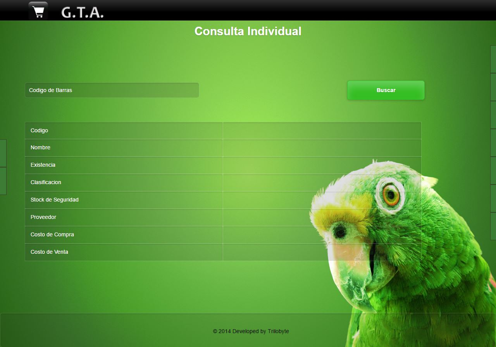

####Consulta por proveedor

###Página de Reportes
####Reporte de ventas

####Reporte de ganancias
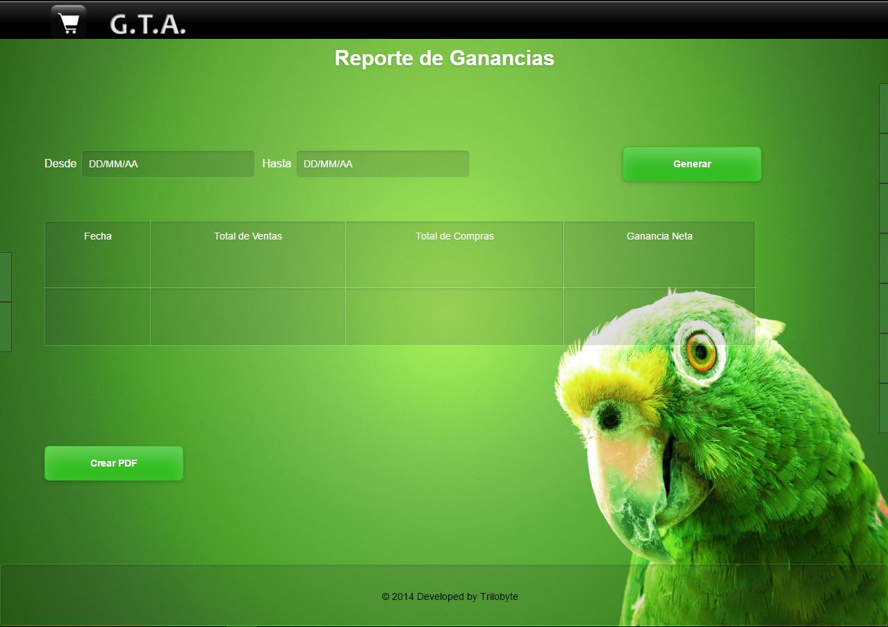

###Página de Gestión
####Proveedores
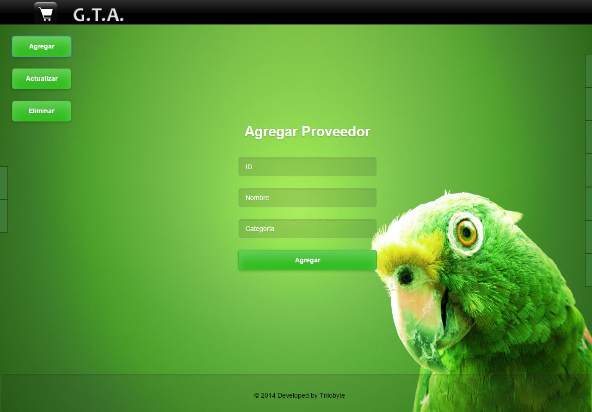

####Empleados
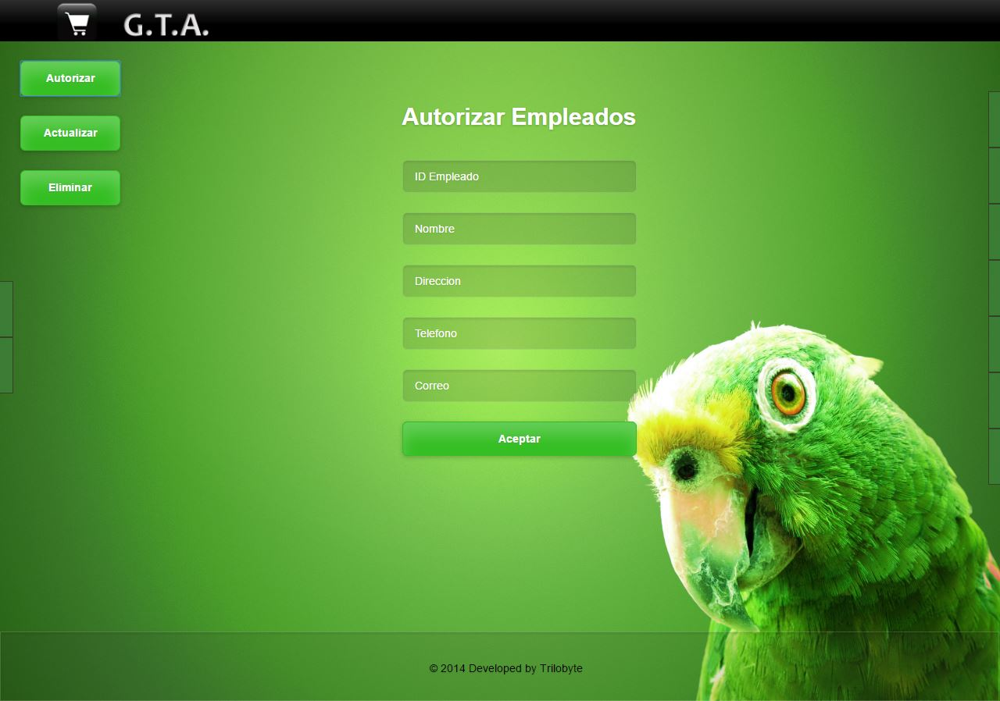

